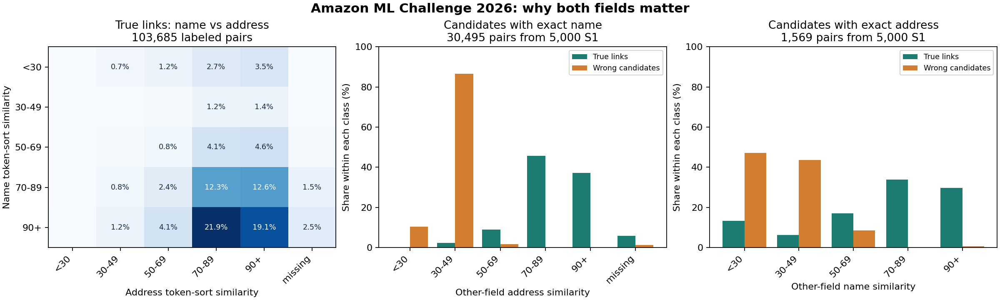

# Amazon ML Challenge 2026: row-level data exploration

_25 September 2026. Exploratory findings from the supplied TSV files only. No external business lookups were used._

## How this was measured

- Full-file scans for row counts, missing fields, source patterns, label validity, country agreement, and repeated Source 1 names/addresses.
- A seeded reservoir sample of **30,000 Source 1 training entities**, containing **103,685 labeled positive pairs**, for transformations and concrete examples. All similarities in this sample use Unicode NFKC, case folding, punctuation separation, and RapidFuzz token-sort ratio unless stated otherwise.
- A separate seeded sample of **5,000 Source 1 entities**, containing **17,312 labeled links**, joined against all training Source 2/3 rows on case-insensitive exact name or exact address to study deceptive nonmatches. These collision results are conditional on the exact-key route and are not overall classifier precision.
- The test France rows were examined without labels; no accuracy claim is possible for France yet.

## The data model is a set-completion problem

There are 2,206,821 train and 1,732,544 test Source 1 rows. Train Source 2/3 contain 10,320,219 rows combined; test Source 2/3 contain 9,969,589. Source 1 has no empty name or address. Training truth has 7,638,365 links; 123,247 Source 1 rows (5.58%) have none. There are 3.46 links per Source 1 on average, with up to **11**. **11.4%** of Source 1 rows have more than five true links, so a final top-five cap would necessarily lose recall.

All 7,638,365 training links point to an existing target, have the same country as their Source 1, and every target ID appears under only one Source 1. This supports exact-country blocking with arbitrary country labels and suggests target-owner conflict resolution. It does not imply that each Source 1 has only one target.

## True-link transformations

| Pattern in 103,685 sampled true pairs | Share |
| --- | ---: |
| Case-insensitive exact name | 10.7% |
| Exact name after basic Unicode/punctuation/spacing normalization | 21.7% |
| Case-insensitive exact address | 7.2% |
| Exact address after basic normalization | 8.2% |
| Name token-sort similarity below 50/100 | 11.2% |
| Address token-sort similarity below 50/100 | 7.9% |
| **Both** similarities below 50/100 | **0.94%** |
| Target address empty | 4.4% |
| Name scripts differ | 7.1% |
| Target name is domain-style | 5.1% |
| Both addresses have numbers but their number sets do not overlap | 7.3% |

The two fields usually compensate for each other. `Gujarat Logistics` has labeled Source 2 names `गुजरात लॉजिस्टिक्स` with very similar addresses. `Lopez and Wilson Guggenheim` has two labeled Source 2 records with empty addresses but recognizable name variants. `Ss Hospitality Private Limited` has one vendor record with almost the full address and other labeled records with a Devanagari name and only `#702, Malad West` or `#702, Mumbai`. These cases defeat a single exact key and show why a strong sibling record might help identify a weak one.

For Indian positives, **22.7% of Source 2** and **12.9% of Source 3** pairs change name script relative to Source 1. Low name similarity (<50) affects 25.5% of India/S2 and 18.5% of India/S3 pairs, compared with 3.7–4.4% in the US. Low address similarity (<50) affects 17.5% of India/S3, versus 6.8% of India/S2. One model can use source as a feature, but blocking needs independent name-led and address-led routes.

Source 3 has a distinct alias channel: about **73,500** train Source 3 names contain common markers such as `dba`, `D.B.A.`, `aka`, `t/a`, or `trading as`; Source 2 has about **70**. A true Source 3 name can be `Pyracira D.B.A. Vijay Ace Business`, while another target is just a `.com` domain based on the Source 1 name. Domain-style names appear in about 4% of Source 2/3 rows and 5.1% of sampled positive links. Alias parsing and domain-stem comparison may help, but should produce evidence rather than automatic matches.

Addresses change through reordering, abbreviations, transliterated state names, typos, inserted/removed unit numbers, and truncation. A labeled record changed `8706 Kentucky Derby Drive` to `870 Kentucky Derby Drive`; another changed `79/2 Shivane` to `5-79/2 Shivane`. Hard rejection on a nonmatching number would discard genuine links. Long Indian addresses average 77.7 characters in Source 1 but 70.2 in Source 2 and 61.0 in Source 3, so partial-address handling matters.

## Labeled nonmatches that look convincing

The 5,000-entity exact-key collision study found:

| Candidate route | Candidate pairs | Labeled true | Labeled wrong | True links recovered from 17,312 |
| --- | ---: | ---: | ---: | ---: |
| Case-insensitive exact name, same country | 30,495 | 1,908 | 28,587 | 11.0% |
| Case-insensitive exact address, same country | 1,569 | 1,255 | 314 | 7.2% |
| Union of the two routes | — | 3,053 | — | **17.6%** |

An identical name is only a candidate signal here: `Mount Zion` appears at different Omaha street addresses under different Source 1 owners. Among the sampled queries, exact-name candidate count has a 99th percentile of **124** and reaches **366** for `Meridian`. In the full Source 1 reference, `Primary Care Group` appears 253 times at distinct addresses. A name-only block can explode in size and attract many wrong branches.

An identical address is stronger but still not proof. `South Foods Private Limited` shares `B-26, Major Dhyan Chnad Nagar, Meerut` with labeled records of different businesses. The full Source 1 set contains addresses shared by up to **14** distinct reference businesses. Two particularly difficult labeled nonmatches are `FRG Smart Terra Inc` versus `FRGU Smart Terra Inc`, and `Iveniq Aura LLC` versus `Iveniqa LLC Aura`, each at the same address. Their target IDs are absent from the first business's truth set despite near-identical text; the data alone cannot tell us whether they are deliberate distractors or labeling mistakes. A precision-focused model must learn to be cautious in this slice. In the 5,000-entity collision sample, 110 candidates matched both fields exactly and all 110 were labeled true, but that is too small to treat double equality as a universal rule.
No two Source 1 records share the same case-folded **name and address together**, consistent with a deduplicated reference. Each field alone repeats often.

## Source and country shifts

Train has US and India. Test additionally has **259,452 French Source 1 rows** and about 1.43 million French Source 2/3 rows. We cannot inspect true French links. In France Source 1, 15.7% of names and 27.8% of addresses contain non-ASCII Latin letters; French target names contain them in about 24% of rows. Preserve the original accented form and build an accent-folded Latin comparison in parallel. Only about **0.4–0.5%** of French address rows contain a standalone five-digit number; a five-digit-postcode blocker would cover very little of this supplied data. Street, building number, and locality matter more.

US/India train and test have strikingly similar average name/address lengths and missing-address rates within each source, suggesting comparable generation/noise for those two countries. France differs and remains the main generalization risk. Source 2/3 addresses are empty on about 3–4% of records, while no Source 1 addresses are empty.

## Data cleaning decisions

**Make multiple views; retain the raw text.** Basic Unicode NFKC/case-fold/punctuation normalization more than doubles exact-name coverage among sampled positives (10.7% to 21.7%), but a normalized equality is not enough to merge. Use the raw, token-normalized, accent-folded Latin, and perhaps later transliterated forms as separate features or retrieval keys.

**Preserve discriminating details.** Keep house/unit numbers, street words, localities, legal suffixes, and alias substrings. Some true links change numbers, yet many different businesses share a building. The model needs both agreement and disagreement features. Do not remove all legal suffixes or generic tokens in place; use a parallel reduced-name view if it improves validation.

**Handle missing and placeholder text narrowly.** Empty target addresses are common. Literal `NULL` or `<NULL>` also occurs as an address component. But `Null Bazar` is a real-looking locality string in Source 1. Remove an isolated placeholder component from a derived view, not every occurrence of the word `null`, and never overwrite the source text.

**Treat country as an open-set string.** Every labeled train link is same-country, so country-equality blocking is supported. Do not encode an assumption that only US and India exist; France must pass through the identical pipeline. Do not use external identity lookup, geocoding, or outside address datasets.

## What to test next

1. Build separate name and address retrieval routes on a held-out set. Report candidate recall by country, source, script change, missing address, short/generic name, and both-weak pairs. Exact-name/address union recovers only 17.6% of links, so fuzzy and rare-token routes are essential.
2. Measure candidate counts and block explosion before full inference. Common names reach hundreds of exact-name candidates even before fuzzy retrieval.
3. Mine hard negatives from real collisions. Train a field-aware scorer and compare full S1-set macro F0.5, including singleton mistakes, rather than pair accuracy alone.
4. Test cautious Source 2–Source 3 sibling evidence for weak direct links and source-specific features. Do not use transitive closure without validation.
5. Stress-test France transfer with country/region holdouts and accent perturbations; there are no labeled France examples for direct threshold tuning.

## Reproduction

The scripts `deep_eda.py`, `collision_eda.py`, `audit_labels.py`, `frequency_eda.py`, `source_patterns.py`, `anomaly_eda.py`, `trace_false_pairs.py`, and `plot_eda.py` in this folder reproduce the measurements and examples. `show_entity.py` prints labeled record groups by Source 1 ID. The JSON files are intermediate analysis outputs; the PNG is the chart above. No model has been fitted and no leaderboard submission has been made in this phase.
